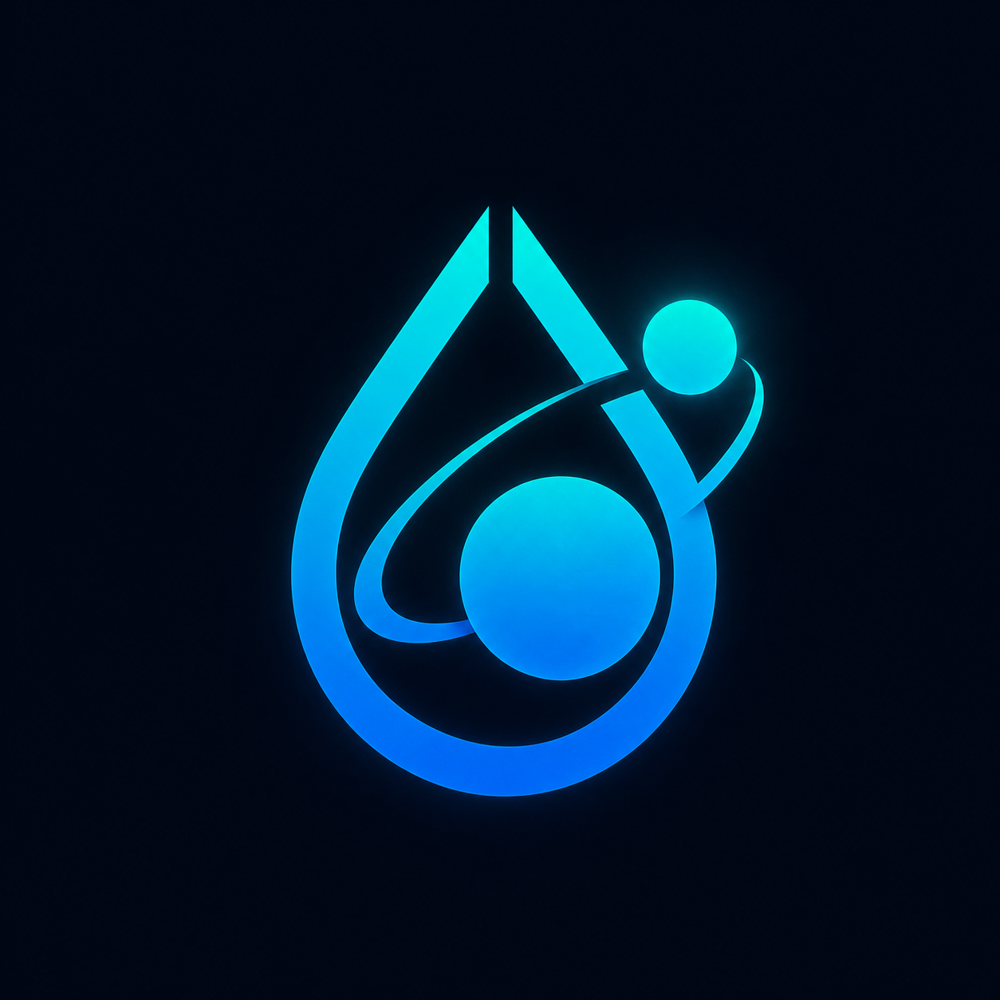

<!----------/qompassai/lua/lua_ls/addons/hyprlua/README.md ------->
<!-- ----------Qompass AI HyprLua lua_ls Addon -------------------->
<!-- Copyright (C) 2026 Qompass AI, All rights reserved ----------->
<!------------------------------------------------------------------>

<div align="center">



<h2>Qompass AI HyprLua</h2>

<h3>lua_ls addon providing full LuaCATS annotations for the Hyprland ≥ 0.55 Lua config API</h3>


<p align="center">
  <a href="https://hyprland.org">
    
  </a>
  <br>
  <a href="https://luals.github.io">
    
  </a>
  <a href="https://www.lua.org">
    
  </a>
  <a href="https://neovim.io">
    
  </a>
  <a href="https://luarocks.org/modules/phaedrusflow/hyprlua">
    
  </a>
  <br>
  <a href="./LICENSES/Apache-2.0.txt">
    
  </a>
  <a href="./LICENSES/BSD-3-Clause.txt">
    
  </a>
</p>

</div><details>
  <summary style="font-size: 1.4em; font-weight: bold; padding: 15px; background: #667eea; color: white; border-radius: 10px; cursor: pointer; margin: 10px 0;">
    <strong>▶️ Quick Start</strong>
  </summary>
  <div style="background: #f8f9fa; padding: 15px; border-radius: 5px; margin-top: 10px; font-family: monospace;">

```sh
git clone https://github.com/qompassai/hyprlua \
  ~/.local/share/nvim/hyprlua
```

Then in your Neovim `lua_ls` setup:

```lua
require("lspconfig").lua_ls.setup({
  settings = {
    Lua = {
      runtime = { version = "Lua 5.4" },
      workspace = {
        library = {
          vim.fn.expand("~/.local/share/nvim/hyprlua/library"),
        },
      },
      diagnostics = { globals = { "hl" } },
    },
  },
})
```

  </div>
</details>

<details>
<summary style="font-size: 1.4em; font-weight: bold; padding: 15px; background: #667eea; color: white; border-radius: 10px; cursor: pointer; margin: 10px 0;"><strong>🗂️ Addon Structure</strong></summary>
<blockquote style="font-size: 1.2em; line-height: 1.8; padding: 25px; background: #f8f9fa; border-left: 6px solid #667eea; border-radius: 8px; margin: 15px 0; box-shadow: 0 2px 8px rgba(0,0,0,0.1);">

```
hyprlua/
├── config.jsonc
├── hyprlua.rockspec
├── library/
│   ├── hl.lua
│   └── hl.config.lua
├── LICENSES/
│   ├── Apache-2.0.txt
│   └── BSD-3-Clause.txt
├── plugin.lua
├── README.md
├── README.pdf
└── settings.json
```

| File | Purpose |
|---|---|
| `library/hl.lua` | All runtime types, classes, sub-namespaces (`hl.dsp.*`, `hl.layout.*`, `hl.notification.*`), and the `hl` global typed as `HL.API` |
| `library/hl.config.lua` | `HL.ConfigKey` alias + `HL.ConfigValueTypes` with concrete return types per key |
| `plugin.lua` | lua_ls `OnSetText` hook — pass-through with optional shebang stripping, scoped to `hypr*.lua` URIs |
| `hyprlua.rockspec` | Authoritative addon manifest using `luarocks-build-lls-addon` build type |
| `config.jsonc` | Legacy `config.json`-style manifest kept for LLS-Addons registry compat |
| `settings.json` | Workspace settings for users who add the library path manually |
| `LICENSES/Apache-2.0.txt` | License for original Qompass AI contributions |
| `LICENSES/BSD-3-Clause.txt` | Required upstream attribution for Hyprland-derived stubs |

</blockquote>
</details>

<details>
<summary style="font-size: 1.4em; font-weight: bold; padding: 15px; background: #667eea; color: white; border-radius: 10px; cursor: pointer; margin: 10px 0;"><strong>📦 Installation</strong></summary>
<blockquote style="font-size: 1.2em; line-height: 1.8; padding: 25px; background: #f8f9fa; border-left: 6px solid #667eea; border-radius: 8px; margin: 15px 0; box-shadow: 0 2px 8px rgba(0,0,0,0.1);">

### Option A — Manual (recommended while pre-release)

```sh
git clone https://github.com/qompassai/hyprlua \
  ~/.local/share/nvim/hyprlua
```

Add to your `lua_ls` setup:

```lua
-- nvim-lspconfig
require("lspconfig").lua_ls.setup({
  settings = {
    Lua = {
      runtime    = { version = "Lua 5.4" },
      workspace  = { library = { vim.fn.expand("~/.local/share/nvim/hyprlua/library") } },
      diagnostics = {
      globals = { "hl" } },
    },
  },
})

-- Neovim nightly native LSP (vim.lsp.config)
vim.lsp.config("lua_ls", {
  settings = {
    Lua = {
      runtime    = { version = "Lua 5.4" },
      workspace  = { library = { vim.fn.expand("~/.local/share/nvim/hyprlua/library") } },
      diagnostics = { globals = { "hl" } },
    },
  },
})
```

### Option B — `.luarc.jsonc` workspace config

Add to your Hyprland config directory's `.luarc.jsonc`:

```jsonc
{
  "runtime": { "version": "Lua 5.4" },
  "workspace": {
    "library": ["~/.local/share/nvim/hyprlua/library"],
    "checkThirdParty": false
  },
  "diagnostics": {
    "globals": ["hl"],
    "disable": ["lowercase-global"]
  }
}
```

### Option C — luarocks

```sh
luarocks install hyprlua
```

Requires `luarocks-build-lls-addon`. The library path is resolved automatically.

### Option D — LLS-Addons registry

Once published to the community registry, enable via:

```jsonc
{ "Lua.addonManager.enable": true }
```

Then install `hyprlua` from the addon manager UI in your editor.

</blockquote>
</details>

<details>
<summary style="font-size: 1.4em; font-weight: bold; padding: 15px; background: #667eea; color: white; border-radius: 10px; cursor: pointer; margin: 10px 0;"><strong>💡 Usage</strong></summary>
<blockquote style="font-size: 1.2em; line-height: 1.8; padding: 25px; background: #f8f9fa; border-left: 6px solid #667eea; border-radius: 8px; margin: 15px 0; box-shadow: 0 2px 8px rgba(0,0,0,0.1);">

Full autocomplete, hover docs, and type-checking on the `hl` global in `hyprland.lua`:

```lua
-- hl.get_active_window() → HL.Window|nil  (typed, autocompleted)
local win = hl.get_active_window()
if win then
  hl.notification.create({ text = win.class, timeout = 3000 })
end

-- Typed bind options + dispatcher namespaces
hl.bind("SUPER + RETURN", hl.dsp.exec_cmd("kitty"), { description = "Open terminal" })

-- Custom layout — full HL.LayoutContext / HL.LayoutTarget types
hl.layout.register("columns", {
  recalculate = function(ctx)
    local n = #ctx.targets
    for i, t in ipairs(ctx.targets) do
      t:place(ctx.column(i, n))
    end
  end,
})

-- HL.EventName alias — all 28 event strings checked + autocompleted
hl.on("window.open", function(win)
  if win.class == "steam" then
    hl.dispatch(hl.dsp.window.float())
  end
end)

-- HL.ConfigKey alias — 300+ dotted keys, narrowed return types
local rounding = hl.get_config("decoration.rounding") -- → integer|boolean
```

**What you get:**

- Autocomplete on all `hl.*` functions and sub-namespaces (`hl.dsp.*`, `hl.notification.*`, `hl.layout.*`, `hl.plugin.*`)
- `HL.EventName` alias — all 28 event strings are checked and completed
- `HL.ConfigKey` alias — 300+ dotted config keys with narrowed return types via `HL.ConfigValueTypes`
- Typed classes: `HL.Window`, `HL.Workspace`, `HL.Monitor`, `HL.Keybind`, `HL.Timer`, `HL.Notification`, `HL.Group`
- Hover docs on every method, field, and option table

</blockquote>
</details>

<details>
<summary style="font-size: 1.4em; font-weight: bold; padding: 15px; background: #667eea; color: white; border-radius: 10px; cursor: pointer; margin: 10px 0;"><strong>🧭 About Qompass AI</strong></summary>
<blockquote style="font-size: 1.2em; line-height: 1.8; padding: 25px; background: #f8f9fa; border-left: 6px solid #667eea; border-radius: 8px; margin: 15px 0; box-shadow: 0 2px 8px rgba(0,0,0,0.1);">

<div align="center">
  <p>Matthew A. Porter<br>
  Former Intelligence Officer<br>
  Educator & Learner<br>
  DeepTech Founder & CEO</p>
</div>

<h3>Publications</h3>
  <p>
    <a href="https://orcid.org/0000-0002-0302-4812">
      
    </a>
    <a href="https://www.researchgate.net/profile/Matt-Porter-7">
      
    </a>
    <a href="https://zenodo.org/communities/qompassai">
      
    </a>
  </p>

<h3>Developer Programs</h3>

[](https://developer.nvidia.com/)
[](https://developers.facebook.com/)
[](https://hackerone.com/phaedrusflow)
[](https://huggingface.co/qompass)
[](https://dev.epicgames.com/)

<h3>Professional Profiles</h3>
  <p>
    <a href="https://www.linkedin.com/in/matt-a-porter-103535224/">
      
    </a>
    <a href="https://www.linkedin.com/company/95058568/">
      
    </a>
  </p>

<h3>Social Media</h3>
  <p>
    <a href="https://twitter.com/PhaedrusFlow">
      
    </a>
    <a href="https://www.instagram.com/phaedrusflow">
      
    </a>
    <a href="https://www.youtube.com/@qompassai">
      
    </a>
  </p>

</blockquote>
</details>

<details>
<summary style="font-size: 1.4em; font-weight: bold; padding: 15px; background: #ff6b6b; color: white; border-radius: 10px; cursor: pointer; margin: 10px 0;"><strong>🔥 How Do I Support</strong></summary>
<blockquote style="font-size: 1.2em; line-height: 1.8; padding: 25px; background: #fff5f5; border-left: 6px solid #ff6b6b; border-radius: 8px; margin: 15px 0; box-shadow: 0 2px 8px rgba(0,0,0,0.1);">

<div align="center">

<table>
<tr>
<th align="center">🏛️ Qompass AI Pre-Seed Funding 2023-2025</th>
<th align="center">🏆 Amount</th>
<th align="center">📅 Date</th>
</tr>
<tr>
<td><a href="https://github.com/qompassai/r4r" title="RJOS/Zimmer Biomet Research Grant Repository">RJOS/Zimmer Biomet Research Grant</a></td>
<td align="center">$30,000</td>
<td align="center">March 2024</td>
</tr>
<tr>
<td><a href="https://github.com/qompassai/PathFinders" title="GitHub Repository">Pathfinders Intern Program</a><br>
<small><a href="https://www.linkedin.com/posts/evergreenbio_bioscience-internships-workforcedevelopment-activity-7253166461416812544-uWUM/" target="_blank">View on LinkedIn</a></small></td>
<td align="center">$2,000</td>
<td align="center">October 2024</td>
</tr>
</table>

<br>
<h4>🤝 How To Support Our Mission</h4>

[](https://github.com/sponsors/phaedrusflow)
[](https://patreon.com/qompassai)
[](https://liberapay.com/qompassai)
[](https://opencollective.com/qompassai)
[](https://www.buymeacoffee.com/phaedrusflow)

<details markdown="1">
<summary><strong>🔐 Cryptocurrency Donations</strong></summary>

**Monero (XMR):**

<div align="center">
  
</div>

<div style="margin: 10px 0;">
    <code>42HGspSFJQ4MjM5ZusAiKZj9JZWhfNgVraKb1eGCsHoC6QJqpo2ERCBZDhhKfByVjECernQ6KeZwFcnq8hVwTTnD8v4PzyH</code>
  </div>

<button onclick="navigator.clipboard.writeText('42HGspSFJQ4MjM5ZusAiKZj9JZWhfNgVraKb1eGCsHoC6QJqpo2ERCBZDhhKfByVjECernQ6KeZwFcnq8hVwTTnD8v4PzyH')" style="padding: 6px 12px; background: #FF6600; color: white; border: none; border-radius: 4px; cursor: pointer;">
    📋 Copy Address
  </button>
<p><i>Funding helps us continue our research at the intersection of AI, healthcare, and education</i></p>

</blockquote>
</details>
<details id="Dual-License Notice">
  <summary><strong>What a Dual-License Means</strong></summary>

This addon uses a **dual-license** model:

- **Apache 2.0** — applies to all original Qompass AI work: EmmyLua/LuaCATS annotations, doc comments, addon structure, Neovim integration, and the rockspec.
- **BSD 3-Clause** — applies to stub definitions derived from the Hyprland source generator (`scripts/generateLuaStubs.py`). This attribution is required and cannot be removed.

Apache 2.0 and BSD 3-Clause are compatible licenses. You may use, modify, and redistribute this addon under either license provided the BSD attribution block is preserved in any file that incorporates upstream-derived stubs.

Full license texts are in `LICENSES/Apache-2.0.txt` and `LICENSES/BSD-3-Clause.txt`.

</details>

<details id="FAQ">
  <summary><strong>Frequently Asked Questions</strong></summary>

### Q: Does this work with the old `.conf`-based Hyprland config?

**A:** No. This addon targets the **Lua config API** introduced in Hyprland 0.55. The old `hyprls` LSP handled `.conf` files and is now largely obsolete. If you are still on `.conf`, no action is needed here.

### Q: Why is `HL.Vec2Like` / `HL.CssGap` / `HL.Gradient` undefined in `hl.config.lua`?

**A:** These aliases are defined in `hl.lua`. Both files must be in the same `workspace.library` path. The aliases are also re-declared at the top of `hl.config.lua` as a fallback for lua_ls versions that don't resolve cross-file `@meta` aliases automatically.

### Q: The `hl` global still shows as undefined after install.

**A:** Verify `diagnostics.globals = { "hl" }` is set in your `lua_ls` settings, or that your `.luarc.jsonc` in the Hyprland config directory includes `"diagnostics": { "globals": ["hl"] }`. You can also check `:LspLog` in Neovim for any path resolution errors.

### Q: How do I add this to a NixOS / Home Manager setup?

**A:** Point `programs.neovim.extraLuaConfig` or your `lua_ls` `workspace.library` at a `pkgs.fetchFromGitHub` derivation targeting this repo. A `flake.nix` is planned for a future release.

### Q: Should I use `config.jsonc` or `hyprlua.rockspec`?

**A:** The `*.rockspec` is the current canonical manifest used by `luarocks-build-lls-addon` and the LLS addon manager. `config.jsonc` is kept for legacy compatibility with older LLS-Addons tooling. If you are installing manually via `workspace.library`, neither file is required on your end.

</details>
